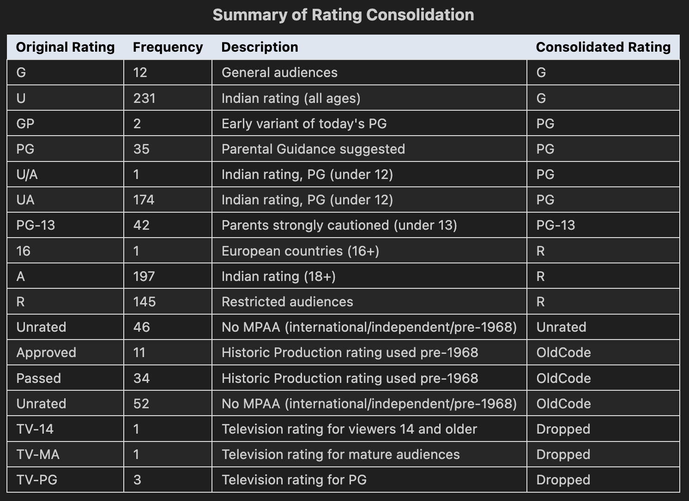

# 🎬 IMDB Top 1000: Critical & Commercial Success Analysis
  
## Executive Summary
This project investigates the dual drivers of cinematic success: **critical acclaim** (IMDB Rating) and **commercial performance** (Gross Revenue). By analyzing the IMDB Top 1000 dataset, we uncovered that **Genre** is the strongest predictor of revenue (with Adventure/Sci-Fi leading), while **Director-Actor collaborations** and **R-ratings** are stronger predictors of critical prestige.

Surprisingly, while G-rated films have the highest *total* lifetime gross, R-rated films achieve the highest average user ratings, challenging the assumption that "family-friendly" always equals "audience favorite".

***

## 🔍 Project Overview
**Goal:** Determine the characteristics, genre, certification, talent, and runtime, that maximize a film's potential for high ratings or high box office returns.

**Dataset:** [IMDB Dataset of Top 1000 Movies and TV Shows (Kaggle)](https://www.kaggle.com/datasets/harshitshankhdhar/imdb-dataset-of-top-1000-movies-and-tv-shows/data)
*   **Observations:** 1,000 top-rated films
*   **Temporal Range:** 1920 – 2020
*   **Key Variables:** `IMDB_Rating`, `Gross`, `Certificate`, `Director`, `Star1`, `Genre`

***

## ⚙️ Data Engineering & Cleaning
Raw real-world data is rarely analysis ready. We performed extensive preprocessing to ensure data integrity.

### 1. Handling Missing & Corrupt Data
*   **Revenue Extraction:** The `Gross` column contained non-numeric characters (`,`). We stripped these and converted to float, treating missing values as `NaN` rather than zero to avoid skewing averages.
*   **Runtime Formatting:** Converted string formats ("142 min") to numeric integers for correlation analysis.

### 2. Feature Engineering: Certification Consolidation
Raw real-world data is rarely analysis-ready. We mapped these to a standardized **6-category system** to enable meaningful aggregation.[1]

| Original Code | Mapped To | Logic |
| :--- | :--- | :--- |
| `U`, `G` | **G** | General Audiences |
| `UA`, `GP`, `PG` | **PG** | Parental Guidance |
| `PG-13` | **PG-13** | Modern Teen Demographic |
| `A`, `R`, `16` | **R** | Restricted/Adult |
| `Approved`, `Passed` | **OldCode** | Pre-1968 Hays Code |

*Figure 1: Overview of the data cleaning pipeline and certification consolidation logic.*

***

## 📊 Exploratory Data Analysis (EDA)

### 1. The Revenue Drivers: Genre & Rating
We hypothesized that "family-friendly" movies earn more. The data confirms this but with nuance. While **R-rated** films have high outlier hits, **G and PG** films have a higher median gross and total cumulative revenue.[2]

*Figure 2: Boxplot showing the distribution of Gross Revenue across standardized certificates.*

### 2. Trends Over Time (Inflation Adjusted)
When adjusted for inflation, the **1970s** emerges as the most profitable decade per film (the "Blockbuster Era"), while the 2010s show a dip in average per-film gross despite high totals, likely due to market saturation.

*Figure 3: Average Gross Revenue by Decade, broken down by Certificate.*

### 3. The "Critical vs. Commercial" Divide
Who consistently delivers quality?
*   **Directors:** We identified a divergence between "Critical" directors and "Commercial" directors.
    *   *Critical Leaders:* **Frank Darabont** (Avg 8.78) and **Lana Wachowski**.[4]
    *   *Commercial Leaders:* **Anthony Russo** and **James Cameron** (Avg Gross >$350M).[4]
*   **The "Sweet Spot":** Films rated **8.5–9.0** actually earn *more* on average than films rated >9.0. This suggests that "perfect" movies are often niche art-house films, while "excellent" movies (8.5 range) have broader mass appeal.

*Figure 4: Top 10 Directors by Average IMDB Rating (Left) vs. Average Gross Revenue (Right).*

### 4. Correlation Analysis
A heatmap of numerical features reveals:
*   **Votes vs. Gross (0.55):** Strong positive correlation. Popularity drives box office (or vice versa).
*   **Rating vs. Gross (0.09):** Surprisingly weak correlation. A movie does not need to be critically perfect to be a financial hit.[5]

*Figure 5: Pearson correlation matrix of numerical variables.*

***

## 💡 Key Findings
| Feature | Insight Derived |
| :--- | :--- |
| **Genre** | **Adventure, Action, and Sci-Fi** are the undisputed kings of revenue. Drama leads in quantity but trails in average gross. |
| **Certification** | **R-rated** films have the highest average IMDB scores (audience preference for mature themes), but **G/PG** films rule the box office. |
| **Collaboration** | Specific **Director-Actor pairs** (e.g., Nolan/Bale) statistically outperform random pairings, suggesting chemistry is a quantifiable metric for success. |
| **Decades** | The **2010s** were dominated by franchises, leading to high gross totals but a concentration of revenue in fewer IP-driven titles. |

***

## ⚠️ Limitations & Future Work
*   **Data Cutoff:** The dataset ends in 2020, missing the post-pandemic shift in theatrical vs. streaming release models.
*   **Inflation:** Basic CPI adjustment was used; a more robust "Ticket Price Inflation" model would yield more accurate historic comparisons.
*   **Next Steps:**
    *   Perform **NLP Sentiment Analysis** on the movie overviews to see if "dark/gritty" descriptions correlate with higher ratings.
    *   Build a **Random Forest Regressor** to predict Gross Revenue based on the features engineered in this EDA.

***

*Project for Data Science 200, UC Berkeley.*

***

## 🛠 Tech Stack
*   **Python**: Core programming language.
*   **Pandas**: Data manipulation, type conversion, and missing value handling.
*   **Seaborn / Matplotlib**: Static statistical visualizations (boxplots, bar charts).
*   **Plotly**: Interactive visualizations for complex scatters.

