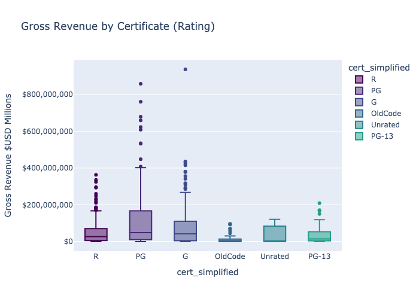
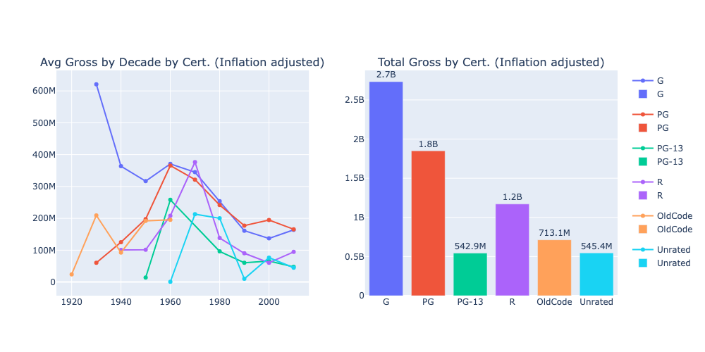
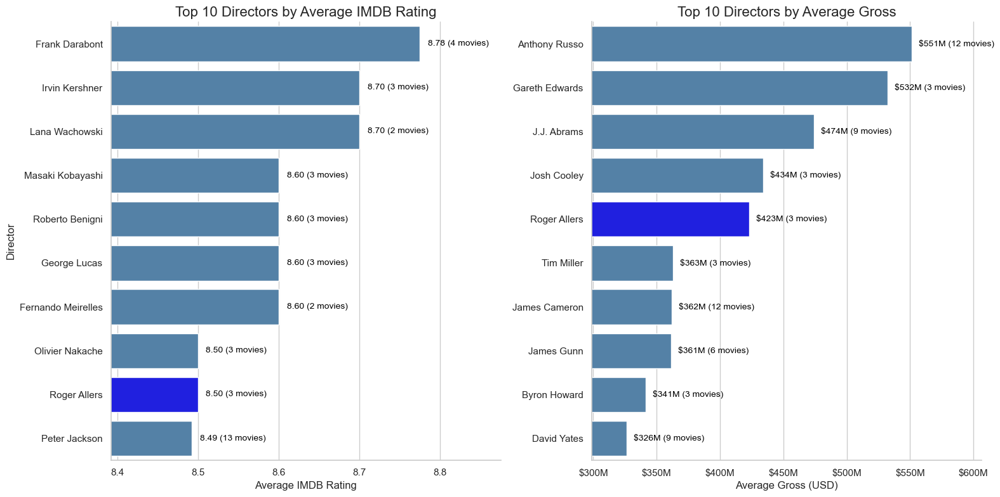
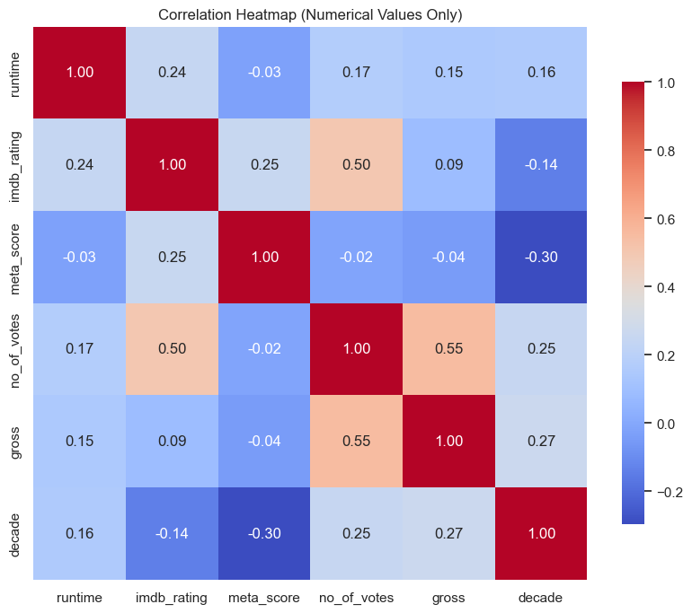

# 🎬 IMDB Top 1000: Critical vs. Commercial Success Analysis
  
## Executive Summary
This project explores the tension between **critical acclaim** (IMDB Rating) and **commercial performance** (Gross Revenue) within the IMDB Top 1000 dataset. By engineering standardized certification features and adjusting for 100 years of inflation, we uncovered that **genre and certification** drive financial success, while **director-actor chemistry** drives critical prestige.

Notably, our inflation-adjusted analysis identifies the **1970s as the peak era for per-film profitability**, challenging the recency bias of modern box office records.

***

## 🔍 Project Overview
Our goal is to quantify the characteristics: genre, certification, talent, and runtime, that maximize a film's potential for high ratings vs. high box office returns.

**Dataset:** [IMDB Dataset of Top 1000 Movies and TV Shows (Kaggle)](https://www.kaggle.com/datasets/harshitshankhdhar/imdb-dataset-of-top-1000-movies-and-tv-shows/data)
*   **Scope:** 1,000 top-rated films from 1920 – 2020.
*   **Key Variables:** `IMDB_Rating`, `Gross`, `Certificate`, `Director`, `Star1`, `Genre`.

***

## ⚙️ Data Engineering Pipeline
Raw archival data required significant preprocessing to enable comparative analysis.

### 1. Feature Engineering: Certification Consolidation
The dataset contained 15+ disparate rating codes from various eras (e.g., *Approved*, *GP*, *U/A*). We mapped these to a standardized **6-category system**, reducing noise and enabling statistically significant group comparisons.

| Original Code | Mapped To | Logic |
| :--- | :--- | :--- |
| `U`, `G` | **G** | General Audiences |
| `UA`, `GP`, `PG` | **PG** | Parental Guidance |
| `PG-13` | **PG-13** | Modern Teen Demographic |
| `A`, `R`, `16` | **R** | Restricted/Adult |
| `Approved`, `Passed` | **OldCode** | Pre-1968 Hays Code |

### 2. Data Cleaning & Normalization
*   **Revenue parsing:** Removed non-numeric characters from `Gross` and cast to float.
*   **Inflation Adjustment:** Normalized revenue data to 2020 USD using CPI metrics to allow for fair comparison between 1930s classics and 2010s blockbusters.
*   **Null Handling:** Strategic removal of records with missing `Gross` or `Runtime` to prevent zero-skewing in aggregation.

---

## 📊 Exploratory Analysis & Insights

### 1. Revenue Drivers: Genre & Certification
We hypothesized that "family-friendly" movies earn more. The data confirms this with nuance:
*   **G and PG** films command the highest median gross revenue, benefiting from the widest possible audience.
*   **R-rated** films, while critically acclaimed, show a lower median gross, though outliers (e.g., *Joker*) prove that adult themes can still yield massive ROI.

  

*Figure 1: Distribution of Gross Revenue by Certificate. Note the higher median stability of G/PG films compared to the high-variance R category.*

### 2. Temporal Trends (Inflation Adjusted)
When adjusting for inflation, the narrative shifts. While the 2010s boast high *total* revenue due to franchise volume, the **1970s** emerges as the most efficient decade per film.
*   **The "Sweet Spot":** Films rated **8.5–9.0** consistently out-earn films rated **9.0+**. This suggests that "perfect" movies are often niche art-house films, while "excellent" movies (8.5 range) have broader mass appeal.

  

*Figure 2: Inflation-Adjusted Average Gross Revenue by Decade. Note the massive spikes in the 1930s (Golden Age) and 1970s (New Hollywood).*

### 3. The Director's Dilemma: Critical vs. Commercial
We identified distinct clusters of directors based on their optimization strategy:
*   **Commercial Titans (Top Right):** **James Cameron** and **Anthony Russo** deliver massive box office hits with strong, but not top-tier, ratings.
*   **Critical Darlings (Bottom Right):** **Hayao Miyazaki** and **Frank Darabont** achieve near-perfect scores but with more modest financial returns.
*   **The Dual Threats:** **Christopher Nolan** and **Peter Jackson** exist in the rare upper-right quadrant, maximizing both critical and commercial success.

  

*Figure 3: Bubble chart mapping Directors by Average IMDB Rating (X) vs. Average Gross (Y). Bubble size represents movie count.*

### 4. Correlation Matrix
A Pearson correlation analysis reveals:
*   **Votes vs. Gross (0.55):** Strong positive correlation; popularity is a better proxy for box office than quality is.
*   **Rating vs. Gross (0.09):** Extremely weak correlation. High quality does not guarantee high revenue.

  

*Figure 4: Correlation heatmap of numerical features.*

---

## 💡 Key Findings

| Dimension | Key Insight |
| :--- | :--- |
| **Genre** | **Adventure, Action, and Sci-Fi** are the undisputed kings of revenue. Drama leads in production volume but trails in average gross per unit. |
| **Talent** | Franchise stars (e.g., **Daniel Radcliffe**) dominate gross revenue tables, often decoupling financial success from critical rating. |
| **Ratings** | **R-rated** films actually achieve the highest *average* IMDB scores, debunking the idea that mass-appeal PG-13 movies are "better" liked by audiences. |
| **Decades** | The **2010s** favored franchise quantity, while the **1970s** favored individual blockbuster quality (e.g., *Star Wars*, *The Godfather*). |

---

## ⚠️ Limitations & Future Work
*   **Data Cutoff:** The dataset concludes in 2020, excluding the post-pandemic shift to streaming-first releases.
*   **Certificate Granularity:** Even with consolidation, international ratings (e.g., "U", "UA") are imperfect proxies for US-centric MPAA ratings.
*   **Next Steps:**
    *   **NLP Analysis:** Perform sentiment analysis on movie synopses to detect if "darker" plot descriptions correlate with higher IMDB ratings.
    *   **Predictive Modeling:** Train a **Random Forest Regressor** to predict Gross Revenue based on the features engineered in this EDA.

---

*Project for Data Science 200, UC Berkeley.*

